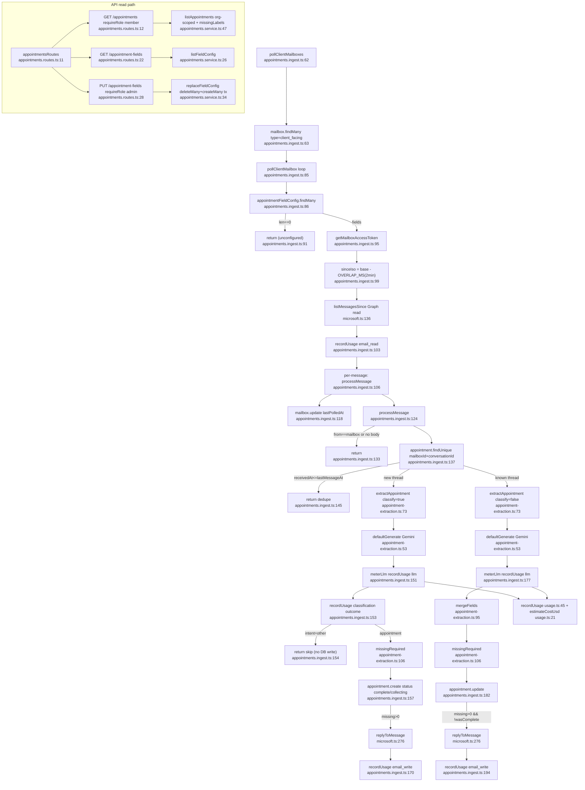

# Flowchart — Appointments (client emails)

Entry: ingest `pollClientMailboxes()` (`appointments.ingest.ts:62`); API `appointmentsRoutes` at `app.ts:103`. Classify-then-extract on new threads; extract-only on known threads. **Extraction is Gemini-only** here (`appointment-extraction.ts:53`, `gemini-3.5-flash`) — has NOT adopted the OpenAI-primary/fallback the orders path uses.

## Side effects
- DB writes: `Appointment.create` (:157)/`update` (:182), `Mailbox.update` watermark (:118), `AppointmentFieldConfig` delete+create (PUT route)
- `UsageEvent` writes: email_read (:103), llm (:151,:177), classification (:153), email_write (:170,:194)
- Graph reads: `listMessagesSince` (:101); Graph writes: `replyToMessage` (:169,:193)

## External dependencies
- `lib/appointment-extraction.ts` (**Gemini-only**, `@google/genai`, `gemini-3.5-flash`), `lib/microsoft.ts` (list/reply, shared with vendor poll), `lib/usage.ts` (`recordUsage`), `lib/mailbox-token.ts`

## Confidence + gaps (duplication-relevant)
- **High** — ingest + extraction + usage + API read traced from full reads.
- **Pipeline duplication:** ingest loop mirrors `poll.service.ts` pollMailbox (load mailboxes by type → token → sinceIso−OVERLAP → listMessagesSince → recordUsage email_read → per-message → lastPolledAt). See `02-duplication-report.md`.
- **Extraction-layer divergence:** Gemini-only here vs OpenAI-primary+Gemini-fallback in `lib/extraction.ts`. On branch `feat/openai-provider`; `usage.ts` PRICES already lists gpt-* + gemini-3.5-flash → appointments not yet migrated to the provider abstraction. **Accidental divergence, not specialization.**
- **`meterLlm` third copy** (`appointments.ingest.ts:151,177`) of the `recordLlmUsage` wrapper.
