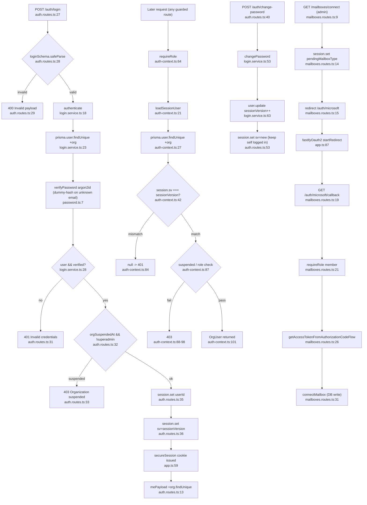

# Flowchart — Auth & Sessions

Entry: `authRoutes` at `app.ts:98`. Login is rate-limited 10/min/IP (`auth.routes.ts:25`). Session = encrypted `@fastify/secure-session` cookie carrying `userId` + `sv` (sessionVersion), `httpOnly`/`secure`(prod)/`sameSite:lax`/7d (`app.ts:59`).

The OAuth mailbox-connect bootstrap **originates** from the auth session (`pendingMailboxType` stashed in the cookie) but its handler lives in `mailboxes.routes.ts` — shown here because the session is the seam.

## Login, session gating, change-password, OAuth bootstrap

## Side effects
- DB reads: `user.findUnique` (authenticate / loadSessionUser / changePassword), `organization.findUnique` (mePayload)
- DB writes: `user.update` sessionVersion++ (changePassword); `connectMailbox` (OAuth path)
- Cookie: set on login; `session.delete()` on logout / me-failure (`auth.routes.ts:60,64,71`)
- External: Microsoft OAuth2 token exchange (OAuth path only)

## External dependencies
- `@fastify/secure-session`, `@fastify/oauth2` (`microsoftOAuth2`), `@fastify/rate-limit`, `argon2`, Prisma
- `mailboxes.service.ts` (`connectMailbox`) — OAuth bootstrap target
- **`requireRole`/`loadSessionUser` is the shared guard consumed by 8 route modules** (orders, organizations, users, mailboxes, appointments, usage, logs, auth) — the central cross-feature seam.

## Confidence + gaps
- **High** — all scope files read in full. OAuth callback handler is in `mailboxes.routes.ts`, not auth.
- Anti-enumeration: unknown email still runs `argon2.verify` against `DUMMY_HASH` to equalize timing (`login.service.ts:15-16`).
