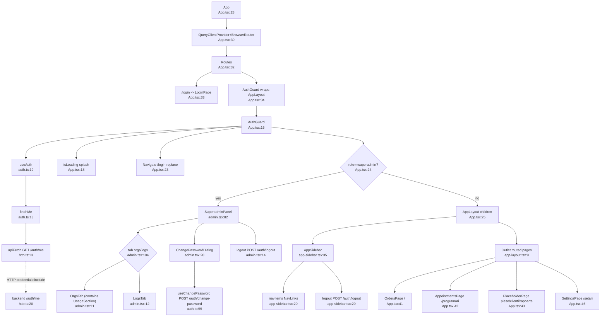

# Flowchart — Frontend Shell

Entry: `App` (`App.tsx:28`). AuthGuard loads `/auth/me`, then branches: superadmin → `SuperadminPanel` (short-circuits routed children); normal user → `AppLayout` + nav + routed pages. All HTTP via `apiFetch` (`http.ts:13`, `credentials:include`, `x-request-id` for log correlation).

## Side effects
- HTTP: `/auth/me` (drives guard), `/auth/login`, `/auth/logout` (full reload `window.location.href`), `/auth/change-password`
- All requests carry `x-request-id`; 5xx/network errors logged via `log.error` (`http.ts:22`)
- `localStorage`: sidebar collapse state

## External dependencies (backend features called)
- Auth (`/auth/me`, login, logout, change-password) — the only direct calls from the shell; feature pages (orders, appointments, settings, orgs/logs/usage tabs) make their own.

## Confidence + gaps
- **High** on boot→auth→guard→branch.
- **Discrepancy resolved:** Phase-0 brief said SuperadminPanel has a "usage" tab; actual `admin.tsx:104` has only **orgs/logs** tabs — Usage Metering is surfaced *inside* `OrgsTab` (`usage-section.tsx`), not as a top-level tab.
