# Flowchart — Logs

Entry: `logsRoutes` at `app.ts:105`. Two paths: anonymous rate-limited write ingest (POST /logs, source forced "frontend") + backend `writeLog` sink; superadmin keyset-paginated read (GET /logs).

```mermaid
flowchart TD
  subgraph WRITE["Write path"]
    FEevent["FE error/log events<br/>frontend/src/pages/logs.tsx:81"]
    feFetch["apiFetch POST /logs<br/>frontend/src/lib/logs.ts:36"]
    postRoute["app.post /logs (anonymous)<br/>logs.routes.ts:27"]
    rl["rateLimit 30/min per IP<br/>logs.routes.ts:25"]
    bodyParse["bodySchema.safeParse (<=50)<br/>logs.routes.ts:28"]
    r400a["400 Invalid payload<br/>logs.routes.ts:29"]
    loadUser["loadSessionUser (optional)<br/>logs.routes.ts:31"]
    fanout["Promise.all writeLog source=frontend<br/>logs.routes.ts:35"]
    r204["204<br/>logs.routes.ts:52"]
    errHandler["setErrorHandler 5xx<br/>app.ts:110"]
    beWrite["void writeLog source=backend<br/>app.ts:116"]
    logError["logError helper<br/>db-log.ts:57"]
    logErrorCallers["callers: poll.service/worker, appointments.ingest, orders.service<br/>poll.service.ts:110"]
    writeLog["writeLog<br/>db-log.ts:19"]
    testNoop["NODE_ENV=test no-op<br/>db-log.ts:20"]
    logCreate["prisma.log.create (truncate 4000)<br/>db-log.ts:22"]
    swallow["catch swallow -> pino<br/>db-log.ts:36"]
    prune["pruneLogs deleteMany >30d<br/>db-log.ts:50"]
  end
  FEevent --> feFetch --> postRoute --> rl --> bodyParse
  bodyParse -->|invalid| r400a
  bodyParse -->|valid| loadUser --> fanout --> writeLog
  fanout --> r204
  errHandler -->|>=500| beWrite --> writeLog
  logErrorCallers --> logError --> writeLog
  writeLog --> testNoop
  writeLog --> logCreate
  writeLog --> swallow

  subgraph READ["Read path"]
    useLogs["useLogs useInfiniteQuery<br/>frontend/src/lib/logs.ts:48"]
    fetchLogs["fetchLogs build qs<br/>frontend/src/lib/logs.ts:36"]
    getRoute["app.get /logs<br/>logs.routes.ts:56"]
    guard["requireRole superadmin<br/>logs.routes.ts:57"]
    r401["401<br/>auth-context.ts:84"]
    r403["403<br/>auth-context.ts:98"]
    qParse["listLogsQuerySchema.safeParse<br/>logs.routes.ts:59"]
    listLogs["listLogs build where (q insensitive)<br/>logs.service.ts:19"]
    findMany["log.findMany keyset take limit+1<br/>logs.service.ts:28"]
    page["slice + nextCursor<br/>logs.service.ts:34"]
    render["LogsTab + LogDetailDialog<br/>frontend/src/pages/logs.tsx:81"]
  end
  useLogs --> fetchLogs --> getRoute --> guard
  guard -->|no user| r401
  guard -->|not superadmin| r403
  guard -->|ok| qParse --> listLogs --> findMany --> page --> render
```

## Side effects
- DB writes: `Log.create` (writeLog), `Log.deleteMany` (pruneLogs, called from poll worker)
- DB reads: `Log.findMany` (keyset cursor), `user.findUnique` (optional session resolve)

## External dependencies
- Prisma `Log`/`User`, `@fastify/rate-limit`, zod, pino (fallback), React Query, `useOrganizations` (orgId→name)
- `logError` is the backend sink, called from poll/appointments/orders error branches

## Confidence + gaps
- **High** on both paths.
- Gap: the FE client-side logger that *originates* the POST /logs batch (window.onerror/console wrapper) lives elsewhere, not located in `lib/logs.ts` (read-side only).
- `writeLog` no-ops in test (`db-log.ts:20`) — same test-guard pattern as `recordUsage`.
