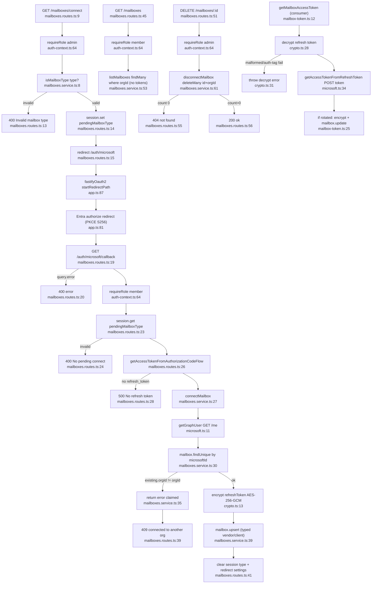

# Flowchart — Mailboxes

Entry: `mailboxesRoutes` at `app.ts:102`. Connect is a 3-leg OAuth dance (stash type → Entra → callback). Refresh tokens are encrypted AES-256-GCM (`crypto.ts`). Two cross-org guards: reclaim-on-connect (via `microsoftId` uniqueness) and delete (via `orgId` in WHERE).

## Connect / list / disconnect / token-consume

## Side effects
- DB writes: `Mailbox.upsert` (connect), `deleteMany` (disconnect), `update` (token rotation)
- Encryption: AES-256-GCM, 12-byte IV, `iv.ct.tag` base64; key from `ENCRYPTION_KEY` (`crypto.ts`)
- Microsoft Graph `GET /me` (connect); Entra `POST .../token` (refresh, consume side)
- Session writes: `pendingMailboxType` set/clear

## External dependencies
- Microsoft Graph + Entra OAuth2, `@fastify/oauth2`, `@fastify/secure-session`, Node `crypto`, Prisma, zod
- **`lib/microsoft.ts` (Graph client) + `lib/mailbox-token.ts` are shared with both poll pipelines** — central cross-feature seam (token mint/refresh)

## Confidence + gaps
- **High** on connect/list/disconnect, encryption, org-scoping, both reclaim guards.
- Gap: `getGraphUser` / zod parse failures bubble to the global error handler (not handled locally). Decrypt failure only on the consume path (poller/send), not traced here.
