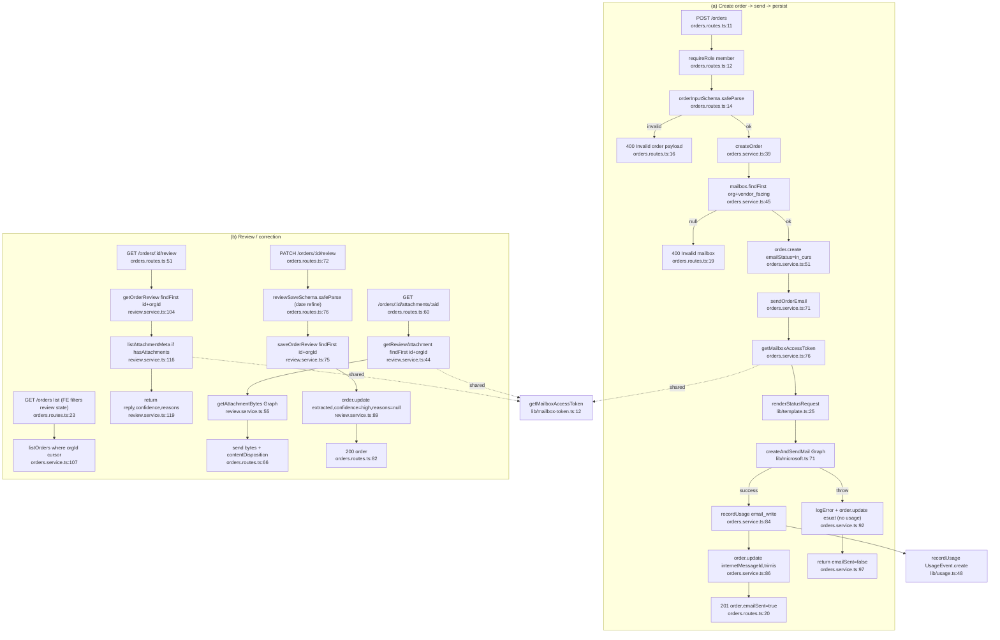

# Flowchart — Orders (+ Review)

Entry: `ordersRoutes` at `app.ts:99`. Two flows: (a) create order → render → Graph send → persist; (b) human review/correction of poller-extracted fields. `OrderReply` is **read-only** here — it is written by the poller (see `poll-extract-vendor.md`).

## Side effects
- DB writes: `Order.create`, `Order.update` ×N (send success/fail, save review), `UsageEvent.create` (email_write only)
- Graph: `createAndSendMail` (draft→send→DELETE-on-fail), attachment meta/bytes reads
- Usage `email_write` recorded only on Graph send **success**

## External dependencies
- `lib/microsoft.ts` (`createAndSendMail`, attachments), `lib/mailbox-token.ts` (shared token mint), `lib/template.ts` (`renderStatusRequest`), `lib/usage.ts`, `lib/confidence.ts` (review confidence types)

## Confidence + gaps
- **High** for both happy paths.
- **No server-side "needs_review" listing endpoint** — `listOrders` returns all org orders; FE decides review state from `replyStatus`/`*Confidence`/`reviewReasons` fields *written by the poller*.
- Prior obs #184: stored-XSS risk via attacker-controlled attachment `contentType` echoed at `orders.routes.ts:67` — adjacent security note, out of Pathfinder scope.
