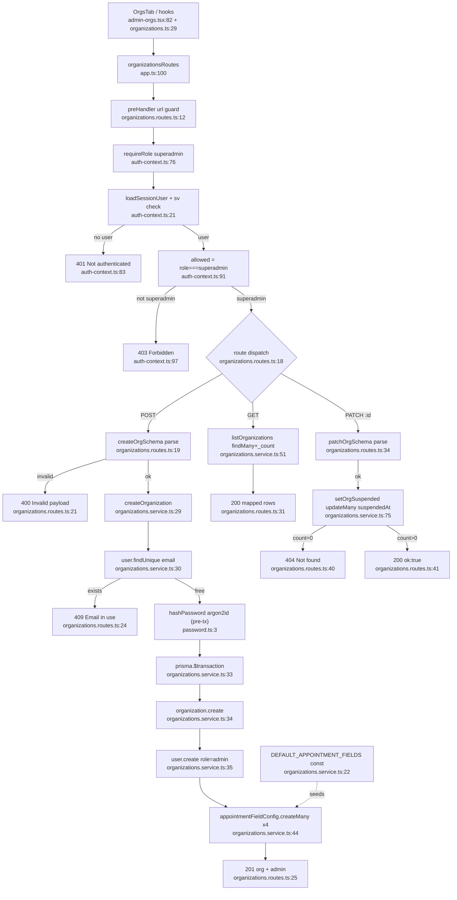

# Flowchart — Organizations (superadmin)

Entry: `organizationsRoutes` at `app.ts:100`. Every route gated by `requireRole("superadmin")` preHandler (`organizations.routes.ts:12`). Superadmin has `orgId === null` and bypasses the suspended-org check (`auth-context.ts:87`).

## Create / list / suspend

## Side effects
- DB writes (atomic `$transaction`): `Organization.create`, `User.create` (admin), `AppointmentFieldConfig.createMany` ×4 (nume/telefon/serviciu/dataDorita) — `service.ts:34-46`
- DB write: `Organization.updateMany` suspendedAt (suspend/reactivate) — `service.ts:82`
- argon2id hashing (runs **before** the tx) — `password.ts:4`

## External dependencies
- `lib/password.ts`, `lib/auth-context.ts` (shared guard), Prisma `$transaction`, zod
- **Seeds appointment field config** consumed later by the Appointments feature
- FE: `@tanstack/react-query`, `apiFetch`, `logAction` (audit logging into the Logs feature)

## Confidence + gaps
- **High** on backend path (all files read in full).
- Gap: dup-email pre-check (`service.ts:30`) is non-atomic vs in-tx `user.create`; the `User.email` unique constraint backstops a race (rollback). Hash before tx wastes work on rollback (cosmetic).
- Same org-scoped role-gate + CRUD shape as Users/Mailboxes — duplication candidate.
