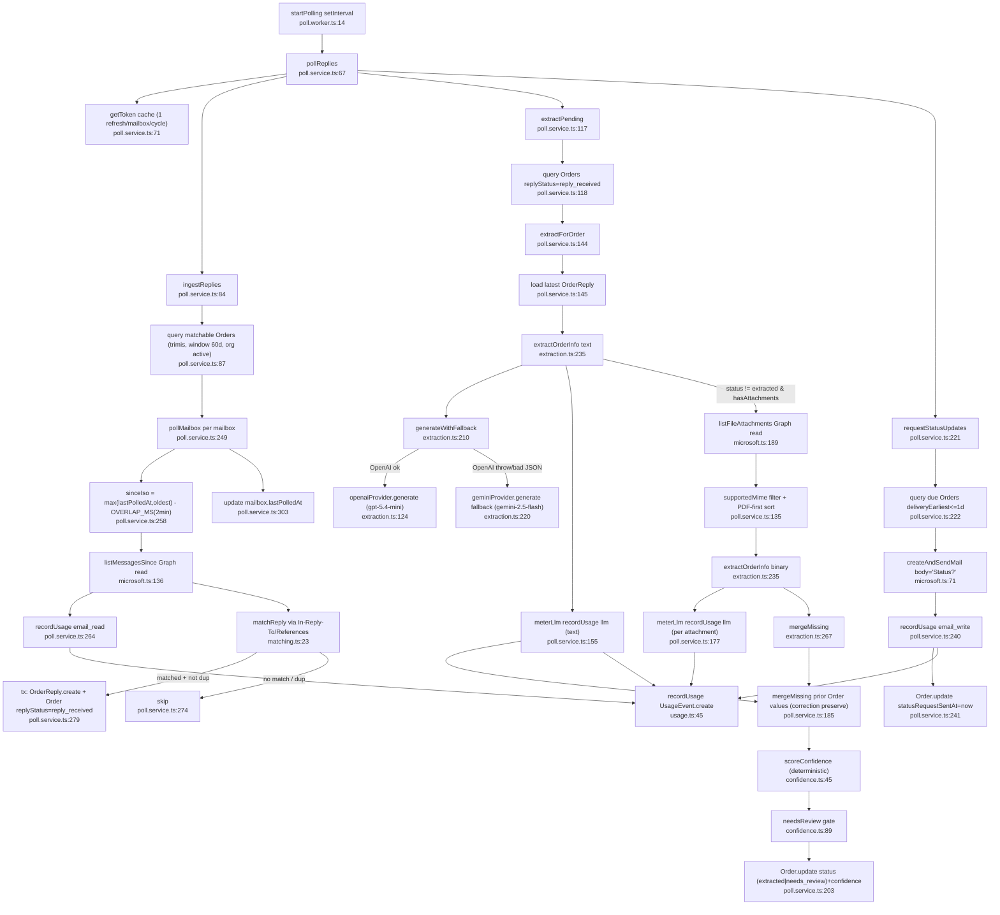

# Flowchart — Poll & Extract (vendor replies)

Entry: `startPolling()` (`poll.worker.ts:14`, setInterval default 5min, reentrancy-guarded) → `pollReplies()` (`poll.service.ts:67`). Three phases: ingest (match+persist replies) → extract (LLM) → status nudge.

## Side effects
- DB writes: `OrderReply.create` (:280), Order `replyStatus`/extraction update (:292,:203), `mailbox.lastPolledAt` (:303), `Order.statusRequestSentAt` (:241), `UsageEvent.create` ×4 kinds
- Graph reads: `listMessagesSince` (:262), `listFileAttachments` (:170); Graph send: `createAndSendMail` Status? (:235)

## External dependencies
- `lib/microsoft.ts` (Graph list/send/attachments), `lib/extraction.ts` (OpenAI primary + Gemini fallback, returns `usage`), `lib/usage.ts` (`recordUsage`), `lib/confidence.ts` (`scoreConfidence`/`needsReview`)

## Confidence + gaps (duplication-relevant)
- **High** — pipeline read end-to-end.
- **`meterLlm` (`poll.service.ts:40`) duplicates `recordLlmUsage` (`usage.ts:67`) almost verbatim** — poll uses its local copy. Appointments has a third copy. → top consolidation candidate.
- **Two-pipeline duplication:** this path mirrors `appointments.ingest.ts` (load mailboxes by type → getMailboxAccessToken → sinceIso−OVERLAP → listMessagesSince → recordUsage email_read → per-message loop → update lastPolledAt). See `02-duplication-report.md`.
- Brief premise wrong: status nudge body is literal `"Status?"` (:239), NOT `lib/template.ts`. `template.ts` is used only for LLM prompts in `extraction.ts`.
- Attachment fallback meters every attachment call (cost accrues per attachment).
