# Flowchart — Usage Metering

Entry: write side via `recordUsage`/`recordLlmUsage` (`lib/usage.ts:45/67`) called from poll, appointments, orders; read side `usageRoutes` at `app.ts:104`. Authored by orchestrator (verified end-to-end against live Postgres earlier this session).

## Record → aggregate → report

```mermaid
flowchart TD
  subgraph WRITE["Record path (called from features)"]
    P1["poll meterLlm<br/>poll.service.ts:40"] --> RU["recordUsage<br/>usage.ts:45"]
    P2["appointments meterLlm<br/>appointments.ingest.ts:151,177"] --> RU
    P3["recordLlmUsage<br/>usage.ts:67"] --> RU
    P4["email_read/write/classification<br/>poll.service.ts:240,264 / appointments.ingest.ts:103,153,170,194 / orders.service.ts:84"] --> RU
    RU --> TEST{"NODE_ENV==test?<br/>usage.ts:46"}
    TEST -->|yes| NOOP["return no-op"]
    TEST -->|no| COST["estimateCostUsd PRICES table<br/>usage.ts:21"]
    COST --> CREATE["prisma.usageEvent.create (best-effort)<br/>usage.ts:48"]
    CREATE -->|throws| SWALLOW["catch -> logger.error<br/>usage.ts:62"]
  end

  subgraph READ["Report path (superadmin)"]
    G["GET /usage<br/>usage.routes.ts:5"] --> GUARD["requireRole superadmin<br/>auth-context.ts:76"]
    GUARD --> QP["usageQuerySchema (from/to datetime)<br/>usage.service.ts:7"]
    QP -->|invalid| Q400["400"]
    QP -->|valid| AGG["aggregateUsage<br/>usage.service.ts:57"]
    AGG --> GB["usageEvent.groupBy [orgId,kind,provider,model,outcome]<br/>usage.service.ts:63"]
    GB --> NAMES["organization.findMany id+name<br/>usage.service.ts:70"]
    NAMES --> ROLL["roll up per org: tokens/cost/emails/classification + byModel<br/>usage.service.ts:80"]
    ROLL --> TOT["overall totals, sort by cost desc<br/>usage.service.ts:103"]
    TOT --> RESP["UsageReport {orgs, totals}"]
    RESP --> FE["usage-section.tsx dashboard"]
  end
```

## Side effects
- DB write: `UsageEvent.create` (best-effort; swallows errors, no-op in test)
- DB read: `usageEvent.groupBy` + `organization.findMany`

## External dependencies
- `prisma`, `zod`, `lib/auth-context.ts` (shared guard)
- **Written into by 3 features** (poll, appointments, orders) — the metering wrapper is the duplication hotspot (see `02-duplication-report.md`): `meterLlm` appears in `poll.service.ts:40` and `appointments.ingest.ts`, both near-identical to `recordLlmUsage` (`usage.ts:67`).

## Confidence + gaps
- **High** — live-verified: recorded llm/email/classification events → aggregateUsage returned exact expected tokens/cost/email/classification breakdown.
- `estimateCostUsd` PRICES table is hand-maintained; unknown model → $0 (never crashes).
