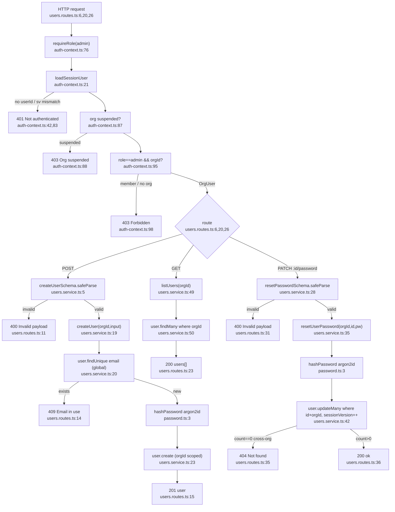

# Flowchart — Users (org admin)

Entry: `usersRoutes` mounted at `app.ts:101`. Exposes **create / list / reset-password** only — there is **no generic update route and no delete route**.

All three routes share the same guard chain: `requireRole("admin")` (`auth-context.ts:76`) → `loadSessionUser` (`auth-context.ts:21`) → 401 (no session / `sv` mismatch), 403 (org suspended), 403 (not admin or no org).

## Happy path + branches

## Side effects
- DB write `user.create` (org-scoped, orgId from session not body) — `users.service.ts:23`
- DB write `user.updateMany` password reset + `sessionVersion++` (revokes target's sessions) — `users.service.ts:42`
- argon2id hashing — `password.ts:3`

## External dependencies
- `lib/auth-context.ts` (`requireRole`/`loadSessionUser`) — shared guard, also used by Organizations, Mailboxes, Orders, Usage, Logs
- `lib/password.ts` (`hashPassword`) — shared with Auth, Organizations
- `prisma` singleton, `@fastify/secure-session`, `zod`

## Confidence + gaps
- **High** — all three files read in full; every node carries file:line.
- Gap: dup-email check (`users.service.ts:20`) is **global, not org-scoped** (email is a global unique key) → a 409 can reveal an email exists in another org. By design but noted.
- Cross-org reset returns **404** (org in WHERE → 0 rows), not 403 — silent, no leak.
