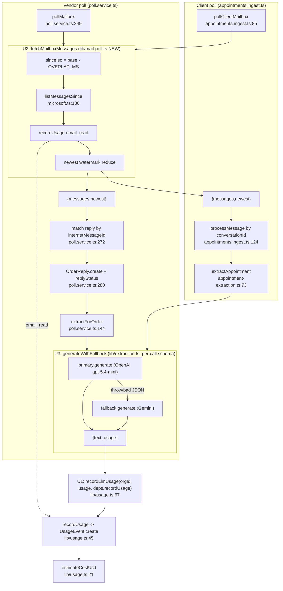

# 03 — Unified Proposal

Three consolidations (D1–D3 from `02-duplication-report.md`). D4 is intentionally left alone. Each design favors **deletion over abstraction** — no registries, no feature flags, no "for flexibility" layers.

---

## U1 — One LLM metering function

**Problem:** `recordLlmUsage` (`lib/usage.ts:67`) is dead; two identical `meterLlm` copies live in `poll.service.ts:40` and `appointments.ingest.ts:47`. Cost/field mapping must stay in sync 3×.

**Design:** Make the existing `recordLlmUsage` the single entry point by letting it take an injectable recorder + tolerate `undefined`. Single signature:

```ts
// lib/usage.ts
export type RecordUsageFn = (e: UsageEventInput) => Promise<void>;

export async function recordLlmUsage(
  orgId: string,
  usage: LlmUsage | undefined,
  record: RecordUsageFn = recordUsage,   // default = module recordUsage; pollers pass deps.recordUsage
): Promise<void> {
  if (!usage) return;
  await record({
    orgId, kind: "llm", provider: usage.provider, model: usage.model,
    promptTokens: usage.inputTokens, completionTokens: usage.outputTokens,
    costUsd: estimateCostUsd(usage.model, usage.inputTokens, usage.outputTokens),
  });
}
```

**Call-site rewrites:**
- `poll.service.ts:40-51` `meterLlm` → **deleted**. Call sites `:155`, `:177` `meterLlm(deps, orgId, usage)` → `recordLlmUsage(orgId, usage, deps.recordUsage)`.
- `appointments.ingest.ts:47-58` `meterLlm` → **deleted**. Call sites `:151`, `:177` → `recordLlmUsage(orgId, usage, deps.recordUsage)`.

**Capability loss:** none. Tests still inject a fake via the 3rd arg.

---

## U2 — One poll envelope, two specialized bodies

**Problem:** `pollMailbox` (`poll.service.ts:249`) and `pollClientMailbox` (`appointments.ingest.ts:85`) duplicate the `OVERLAP_MS` → `sinceIso` → `listMessagesSince` → `recordUsage(email_read)` → newest-watermark sequence (incl. a textually identical reducer at `poll.service.ts:299-302` / `appointments.ingest.ts:114-117`).

**Design:** One helper that returns the messages + the watermark; each caller keeps its own per-message loop and its own `mailbox.update`.

```ts
// lib/mail-poll.ts (new)
export const OVERLAP_MS = 2 * 60 * 1000; // single source

export async function fetchMailboxMessages(
  accessToken: string, base: Date, orgId: string, deps: { recordUsage: RecordUsageFn },
): Promise<{ messages: GraphMessage[]; newest: Date | null }> {
  const sinceIso = new Date(base.getTime() - OVERLAP_MS).toISOString();
  const messages = await listMessagesSince(accessToken, sinceIso);
  if (messages.length > 0) await deps.recordUsage({ orgId, kind: "email_read", emails: messages.length });
  const newest = messages.reduce<Date | null>((acc, m) => {
    const d = new Date(m.receivedDateTime);
    return !acc || d > acc ? d : acc;
  }, null);
  return { messages, newest };
}
```

**Call-site rewrites:**
- `poll.service.ts:258-265,299-302` → `const { messages, newest } = await fetchMailboxMessages(token, base, orgId, deps);` then keep the matching loop (`:272-294`) and `mailbox.update lastPolledAt` (`:303`).
- `appointments.ingest.ts:99-104,114-117` → same call; keep `processMessage` loop (`:106`) and `mailbox.update` (`:118`).
- Delete both `OVERLAP_MS` literals (`poll.service.ts:53`, `appointments.ingest.ts:60`); import from `lib/mail-poll.ts`.

**Explicitly NOT merged:** the inner loops (vendor `internetMessageId` matching vs client `conversationId` classify/extract) — legitimately specialized, left in place. Base-time selection stays in each caller (vendor backfills from oldest order; client does not).

**Capability loss:** none.

---

## U3 — One provider-fallback path for both extractors

**Problem:** `lib/extraction.ts` has `LlmProvider` + `generateWithFallback` (OpenAI primary → Gemini fallback, `:210`); `lib/appointment-extraction.ts:53` is Gemini-only — **no failover**. Same `{text, usage}` return shape; the only real difference is appointments need a **per-call (dynamic per-org) schema**, while extraction.ts bakes a fixed order schema into each provider.

**Design:** Lift the schema out of the provider so one `generateWithFallback` serves both. `LlmProvider.generate` takes the schema as a parameter:

```ts
// lib/extraction.ts (generalized)
export interface LlmProvider {
  generate(parts: ContentPart[], schema: ResponseSchema, today: string): Promise<{ text: string; usage: LlmUsage }>;
}
export async function generateWithFallback(
  parts: ContentPart[], schema: ResponseSchema, today: string, deps: ExtractionDeps,
): Promise<{ text: string; usage: LlmUsage }> {
  try { return await deps.primary.generate(parts, schema, today); }
  catch (err) { deps.logger?.warn?.({ err }, "primary LLM failed, falling back"); return await deps.fallback.generate(parts, schema, today); }
}
```

`openaiProvider`/`geminiProvider` lose their hardcoded order schema (now a param). `extractOrderInfo` (`extraction.ts:235`) passes the fixed order schema; `extractAppointment` (`appointment-extraction.ts:73`) builds its per-org schema (`buildSchema:27`) and passes it — gaining OpenAI-primary + Gemini fallback for free. Delete `appointment-extraction.ts:defaultGenerate:53-69`.

**Capability loss:** none; **capability gain:** appointment classification/extraction gets provider failover it currently lacks.

**Sequencing:** do this **after** the in-flight `feat/openai-provider` work on the order path settles, to avoid colliding with active edits to `extraction.ts`.

---

## Combined unified flowchart



**Net deletions:** 2× `meterLlm`, 1 dead `recordLlmUsage` body folded in, 2× `OVERLAP_MS` literal, 2× watermark reducer, 1× `defaultGenerate`. **Net new files:** `lib/mail-poll.ts`. No new abstraction layers, no flags, no registries.
