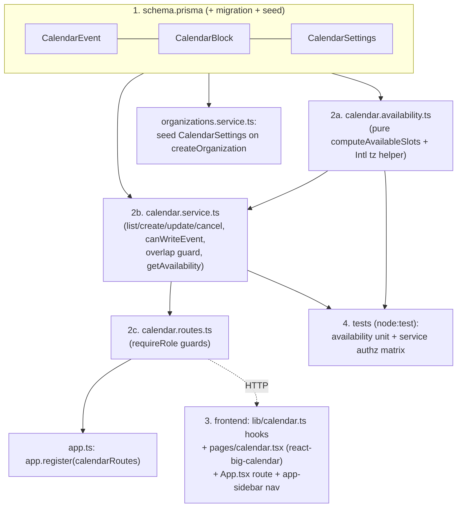

# Calendar Implementation Plan

## Context

This Romanian-language ops app needs a real **calendar of scheduled appointments** — timed events assigned to staff. (Note: "Trenda" appears as the sidebar brand but is a *client* name, not the product; it's being removed separately and is not referenced in this plan.) Today the `Appointment` model (`backend/prisma/schema.prisma:191`) is **not** a calendar event: it's an email-collected *booking request* the LLM ingest pipeline fills field-by-field, with no time and no user assignment. We are adding a scheduling layer on top, without disturbing the existing email-ingest flow.

Goals:
- Create timed events and assign them to org users.
- Role rules: a **member** creates/edits only their own events (and can **claim** unassigned ones); an **admin** (the "owner" role — there is no separate "owner" role in this codebase) creates/edits/assigns for anyone. Members can also create events with **no assignee** (shared pool).
- Block periods for specific users (time-off).
- Org-level **available-slots** API (business hours + capacity), reusable so client-facing email automation can later (a) offer slots and (b) auto-create events.

Build is **phased**: Phase 1 = calendar + roles + blocks + availability API (this build). Phases 2–3 (email offers slots, AI auto-books) are designed here but implemented later.

### Codebase facts grounding this plan (verified)
- **Roles**: only `member` / `admin` / `superadmin` exist. `requireRole("admin", request, reply)` (`backend/src/lib/auth-context.ts:64`) requires `role === "admin"` + an org; `requireRole("member", …)` = any authed user with an `orgId`. Superadmin has no org and is routed to a separate panel, so it's irrelevant to org-scoped calendar routes.
- **GET /users is admin-only** (`backend/src/modules/users/users.routes.ts`). Therefore members must use a "Me / Unassigned" assignee picker (no user list fetch); only admins call `useUsers()` for the full org roster.
- **Module pattern**: each module = `*.routes.ts` (thin, `requireRole` guard + Zod `safeParse` + delegate) + `*.service.ts` (Zod schemas + dependency-injected `deps = { prisma }` default, all queries scoped `where: { orgId }`). Routes registered in `backend/src/app.ts:99-109` via `app.register(...)`.
- **Prisma**: client generated to `src/generated/prisma`, accessed through a proxy seam (`backend/src/prisma.ts`) so tests swap a fake via `setPrismaForTests`. Migrations live in `backend/prisma/migrations/` (latest: `20260622100000_add_vendor_entity`).
- **Tests**: Node's built-in runner (`node --test`, `src/**/*.test.ts`) using `node:test` + `node:assert` — **not** vitest. Route tests use `buildTestApp`/`loginAs` from `backend/src/test-harness.ts` with a fake Prisma.
- **No date/timezone library** anywhere (frontend or backend). Availability math will be dependency-free using `Intl.DateTimeFormat(..., { timeZone }).formatToParts` for DST-correct offset resolution (per decision below).
- **Frontend**: React + React Query (`@tanstack/react-query`) + shadcn/Tailwind. Routes in `frontend/src/App.tsx` (Romanian paths like `/programari`), nav in `frontend/src/components/layout/app-sidebar.tsx` (flat `navItems` array; `CalendarDays` icon already imported). API hooks pattern in `frontend/src/lib/*.ts` via `apiFetch` (`frontend/src/lib/http.ts`).

### Decisions (confirmed with user)
- **Timezone**: single org timezone stored on `CalendarSettings.timezone` (default `Europe/Bucharest`); slot instants computed DST-correctly via a dependency-free `Intl`-based offset helper.
- **Calendar UI library**: **react-big-calendar** (recommended after comparing — see table). FullCalendar's needed views (timeGrid week/day + interaction drag-drop) are also MIT/free (premium only covers resource/timeline, which we don't need), but it uses an imperative API across ~5 plugin packages and its own CSS system that's harder to match to the green shadcn theme. A bespoke CSS-grid is possible but re-implements drag/resize by hand. react-big-calendar is MIT, declarative/React-native, has built-in week/day views, drag-to-move/create via its official `withDragAndDrop` HOC, and themes cleanly with Tailwind overrides. It needs a date localizer — we'll add the lightweight `date-fns` localizer (display only; all availability/business-hours math stays in the backend `Intl` helper). **Multi-user note:** rbc supports per-user side-by-side columns natively via its `resources` props *for free*, whereas FullCalendar's equivalent resource views are paid premium — a further point in rbc's favor.

- **Multi-user view (confirmed)**: Phase 1 ships a **shared color-coded grid** (one week/day grid, events colored by assignee with an assignee filter and the unassigned pool highlighted). **Per-user resource columns** (rbc `resources` — one Day-view column per staff member) are a **fast-follow** after the core works, not part of the Phase 1 build.

| | react-big-calendar (recommended) | FullCalendar | Custom CSS-grid |
|---|---|---|---|
| License | MIT, fully free | MIT core; premium only for resource/timeline (not needed) | n/a |
| New deps | `react-big-calendar` + `date-fns` localizer | `@fullcalendar/{react,core,daygrid,timegrid,interaction}` | none |
| Week/day views | built-in | built-in | hand-built |
| Drag move/create | `withDragAndDrop` HOC | built-in | hand-built |
| API style | declarative React | imperative ref API | n/a |
| Theming to shadcn | Tailwind class overrides | own CSS system | full control |

---

## Phase 1 — Calendar core (this build)

### 1. Schema (`backend/prisma/schema.prisma`)

Add three models following existing conventions (cuid ids, `orgId` + `org` relation, `createdAt`/`updatedAt`, composite indexes like `Order`). Use the model definitions from the draft as-is:

- **`CalendarEvent`** — `title?`, `startAt`, `endAt`, `assigneeUserId?` (null = unassigned/claimable pool) → `assignee User?` rel `"EventAssignee"`, `createdByUserId` → `createdBy User` rel `"EventCreatedBy"`, `customerEmail?`, `customerName?`, `notes?`, `status @default("scheduled")` (scheduled|cancelled|completed), `source @default("manual")` (manual|email), `appointmentId? @unique` → `appointment Appointment?`. Indexes `@@index([orgId, startAt])`, `@@index([assigneeUserId, startAt])`.
- **`CalendarBlock`** — `userId` (blocked user) → `user User` rel `"BlockUser"`, `startAt`, `endAt`, `reason?`, `createdByUserId`. Indexes `@@index([orgId, startAt])`, `@@index([userId, startAt])`.
- **`CalendarSettings`** — `orgId @unique`, `timezone @default("Europe/Bucharest")`, `slotDurationMinutes Int @default(30)`, `capacity Int @default(1)`, `businessHours Json @default("[]")` (array of `{ weekday: 0-6, openMinute, closeMinute }`; absence of a weekday = closed that day).

Back-relations to add:
- `Organization`: `calendarEvents CalendarEvent[]`, `calendarBlocks CalendarBlock[]`, `calendarSettings CalendarSettings?`
- `User`: `assignedEvents CalendarEvent[] @relation("EventAssignee")`, `createdEvents CalendarEvent[] @relation("EventCreatedBy")`, `calendarBlocks CalendarBlock[] @relation("BlockUser")`
- `Appointment`: `calendarEvent CalendarEvent?` (back side of the `@unique appointmentId` link)

Migration: add one new migration via `cd backend && npx prisma migrate dev --name add_calendar`, then `npx prisma generate`. (Dev Postgres is reached through `DATABASE_URL`; the PrismaPg adapter in `src/prisma.ts` handles the connection.)

Seed default `CalendarSettings` in `createOrganization` (`backend/src/modules/organizations/organizations.service.ts:33`, inside the existing `$transaction`, right after `appointmentFieldConfig.createMany`). Add a `DEFAULT_BUSINESS_HOURS` const (Mon–Fri `weekday 1..5`, `openMinute: 540` / `closeMinute: 1020` = 09:00–17:00) next to `DEFAULT_APPOINTMENT_FIELDS`, and `tx.calendarSettings.create({ data: { orgId: org.id, businessHours: DEFAULT_BUSINESS_HOURS } })`.

### 2. Backend module `backend/src/modules/calendar/` (new)

Mirror `modules/appointments/` (routes + service + Zod schemas + injected `deps`).

**`calendar.availability.ts`** — pure, unit-testable, no DB:
- `tzOffsetMinutes(instant: Date, timeZone: string): number` — derive the zone's UTC offset for a given instant via `Intl.DateTimeFormat(..., { timeZone, ... }).formatToParts` (DST-correct). Use it to convert an org-local wall-clock `{ date, minuteOfDay }` to a UTC `Date` and back.
- `computeAvailableSlots({ from, to, settings, events, blocks, now }): { startAt: Date; endAt: Date; availableCount: number }[]` — for each day in `[from, to)`, look up that weekday's business-hours window(s) from `settings.businessHours`; slice into `settings.slotDurationMinutes` slots; for each slot `availableCount = capacity − (events overlapping slot, status !== "cancelled") − (distinct users blocked over slot)`, clamped ≥ 0; drop slots with `availableCount ≤ 0`, outside business hours, or ending ≤ `now`. Overlap = `slot.start < other.endAt && other.startAt < slot.end`.

**`calendar.service.ts`** (Zod schemas + functions, `deps = { prisma }`):
- Query schemas: `rangeQuerySchema` (`from`, `to` as ISO datetimes via `z.coerce.date()`, plus optional `assigneeId` / `userId`), `availabilityQuerySchema` (`from`, `to`, optional `duration`).
- Body schemas: `createEventSchema`, `updateEventSchema` (all fields optional/partial), `createBlockSchema`, `settingsSchema` (`timezone`, `slotDurationMinutes`, `capacity`, `businessHours` array).
- `listEvents(orgId, { from, to, assigneeId? })`, `listBlocks(orgId, { from, to, userId? })` — range-overlap `where`, `orgId`-scoped.
- `createEvent(user, input)`, `updateEvent(user, id, input)`, `cancelEvent(user, id)` (sets `status:"cancelled"`), `createBlock(user, input)`, `deleteBlock(user, id)`.
- `getSettings(orgId)` (returns seeded row; create-on-read fallback if missing), `updateSettings(orgId, input)`.
- `getAvailability(orgId, { from, to, duration? })` — load settings + non-cancelled events + blocks in range, call `computeAvailableSlots`.
- **Authz helper** `canWriteEvent(user, target: { assigneeUserId: string | null }): boolean` — `user.role === "admin"` → always true; member → true only if `target.assigneeUserId === user.id` **or** `target.assigneeUserId === null`. For members, the service **forces** `createdByUserId = user.id` and ignores any client-sent assignee other than self/null. **Claim** = a member PATCHes an unassigned event setting `assigneeUserId = user.id` (allowed because current target is `null`).
- **Overlap guard**: when creating/updating an **assigned** event, reject (HTTP 409) if it collides with that assignee's existing non-cancelled event or block. Skip the guard for unassigned (pool) events.
- All single-entity loads use `where: { id, orgId }` so cross-org access is impossible. Mutations re-check `canWriteEvent` against the freshly-loaded row (never trust client assignee for members).

**`calendar.routes.ts`** (register in `app.ts` alongside the others):

| Method/Path | Guard | Notes |
|---|---|---|
| `GET /calendar/events?from&to&assigneeId` | member | members read all org events |
| `POST /calendar/events` | member | `canWriteEvent`; member self/unassigned only |
| `PATCH /calendar/events/:id` | member | reschedule / reassign / **claim**; 403 if not writable, 409 on overlap |
| `DELETE /calendar/events/:id` | member | own/unassigned → cancel; admin any |
| `GET /calendar/blocks?from&to&userId` | member | |
| `POST /calendar/blocks` | member | member blocks own time; admin any user |
| `DELETE /calendar/blocks/:id` | member | own; admin any |
| `GET /calendar/settings` | member | |
| `PUT /calendar/settings` | admin | timezone, business hours, slot duration, capacity |
| `GET /calendar/availability?from&to&duration` | member | wraps `getAvailability` |

Each route follows the existing thin pattern: `const user = await requireRole(...); if (!user) return reply;` then `schema.safeParse` → 400 on failure → delegate to service. For write routes, map service authz failures to status codes (403 forbidden, 404 not-found, 409 overlap).

### 3. Frontend (new: `frontend/src/lib/calendar.ts`, `frontend/src/pages/calendar.tsx`)

- Add deps: `react-big-calendar` + `date-fns` (localizer). Wrap the calendar with `withDragAndDrop` for drag-to-move/create.
- `frontend/src/lib/calendar.ts` — React Query hooks via `apiFetch`, mirroring `frontend/src/lib/appointments.ts` / `users.ts`: `useCalendarEvents(range)`, `useCreateEvent`, `useUpdateEvent`, `useCancelEvent`, `useBlocks(range)`, `useCreateBlock`, `useDeleteBlock`, `useAvailability(range)`, `useCalendarSettings`, `useUpdateSettings`. Mutations `invalidateQueries(["calendar", ...])` and call `logAction(...)` like `users.ts`.
- `frontend/src/pages/calendar.tsx` — week/day react-big-calendar view scoped to the visible range. **Phase 1 = shared color-coded grid**: events colored by assignee via `eventPropGetter` (stable color per `assigneeUserId`; unassigned pool a distinct highlight), plus an assignee **filter** control (members can filter Mine / Unassigned / All; admins filter by any user from `useUsers(true)`). Event create/edit shadcn `Dialog`: title, start/end, assignee select (members: only "Eu"/"Nealocat"; admins: full roster via `useUsers(true)`), customer fields, notes. Unassigned events carry a **"Revendică"** (Claim) action for members. Block-time UI (own; admins pick a user). Admin-only settings panel (business hours / slot duration / capacity / timezone), gated on `user.role === "admin"` from `useAuth()`.
  - **Fast-follow (post-Phase 1, not now):** per-user **resource columns** via rbc `resources` / `resourceIdAccessor` / `resourceTitleAccessor` in Day view (one column per staff member); Week view stays the combined color-coded grid. No backend changes needed — events already carry `assigneeUserId`.
- Wire up nav + route (Romanian, matching existing style): add `{ to: "/calendar", label: "Calendar", icon: CalendarDays, end: false }` to `navItems` in `app-sidebar.tsx` (icon already imported), and a `<Route path="/calendar" element={<CalendarPage />} />` inside the authed layout block in `frontend/src/App.tsx`. Route is member-accessible (no extra guard); admin-only controls are hidden in-page by role.

### 4. Tests (Node's `node:test` runner)
- `backend/src/modules/calendar/calendar.availability.test.ts` — unit: slot slicing within business hours, capacity subtraction, event + distinct-user-block subtraction, past-slot exclusion, closed-day handling, and a DST-boundary case for the `Intl` offset helper.
- `backend/src/modules/calendar/calendar.service.test.ts` — authz matrix with a fake Prisma (member self/unassigned/claim allowed; member→other-user denied; admin-any allowed; cross-org `where:{id,orgId}` denial; overlap guard 409 for assigned, skipped for pool), in the style of `appointments.service.test.ts`.

---

## Phase 2 — Email offers slots (design only, not built now)
When an email `Appointment` reaches `status:"complete"` in `appointments.ingest.ts`, call `getAvailability` for the next N business days and render the top slots into a new template `backend/templates/appointment-offer-slots` (sibling of `appointment-missing-fields`, via `src/lib/template.ts`). Reply through the existing `replyToMessage`; meter as `email_write`.

## Phase 3 — AI auto-books (design only)
On the client's next reply, extend LLM extraction (`backend/src/lib/appointment-extraction.ts`) to capture the chosen slot, validate against live `getAvailability`, then create a `CalendarEvent` with `source:"email"`, `appointmentId` linked, `assigneeUserId:null` (claimable) or round-robin. Send confirmation email. Re-check availability immediately before insert (concurrency-safe).

---

## Verification
1. `cd backend && npx prisma migrate dev --name add_calendar && npx prisma generate`; confirm `CalendarEvent`/`CalendarBlock`/`CalendarSettings` tables exist.
2. `npm test` in `backend/` — availability unit + service authz suites green.
3. Run backend (`npm run dev`) + frontend; log in (session cookie). API checks via curl with session cookie:
   - member creates event for self → 200/201; member tries to create assigned to another user → 403; admin assigns to a member → 200.
   - create a block; `GET /calendar/availability?from&to` reflects events + blocks + capacity; member PATCHes an unassigned event to claim it → 200.
   - overlapping assigned event → 409; overlapping unassigned (pool) → allowed.
4. UI: create/move/cancel events on the week grid, claim an unassigned event, set a block, admin edits business hours; confirm availability updates and member assignee picker shows only Eu/Nealocat.

## Critical files
- `backend/prisma/schema.prisma` — 3 new models + relations + `Appointment` back-link; one new migration.
- `backend/src/modules/calendar/{calendar.routes,calendar.service,calendar.availability}.ts` (new) + their `*.test.ts`.
- `backend/src/app.ts` — register `calendarRoutes`.
- `backend/src/modules/organizations/organizations.service.ts` — seed `CalendarSettings` + `DEFAULT_BUSINESS_HOURS`.
- `frontend/src/lib/calendar.ts`, `frontend/src/pages/calendar.tsx` (new); `frontend/src/App.tsx` + `frontend/src/components/layout/app-sidebar.tsx` (route + nav); `frontend/package.json` (`react-big-calendar`, `date-fns`).
